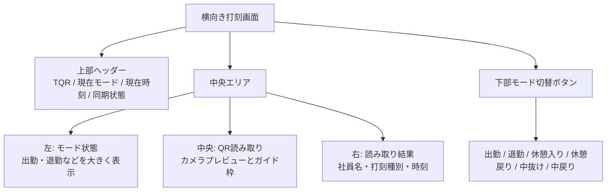
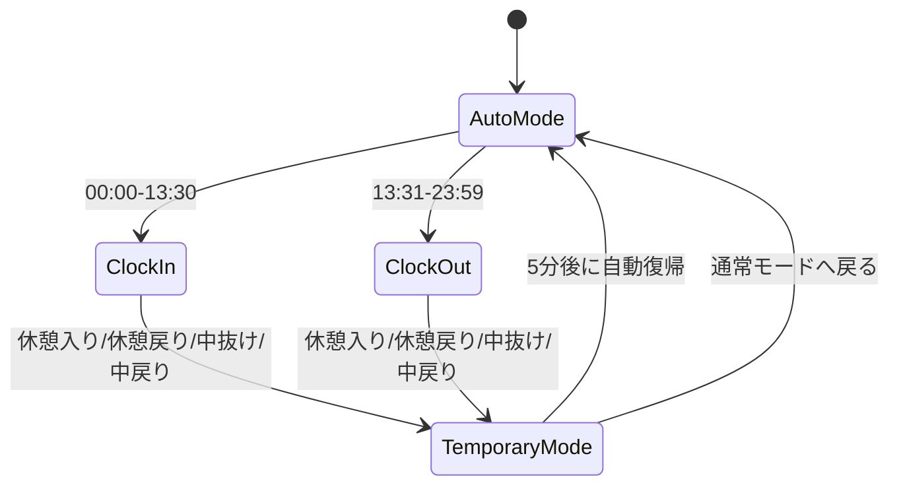
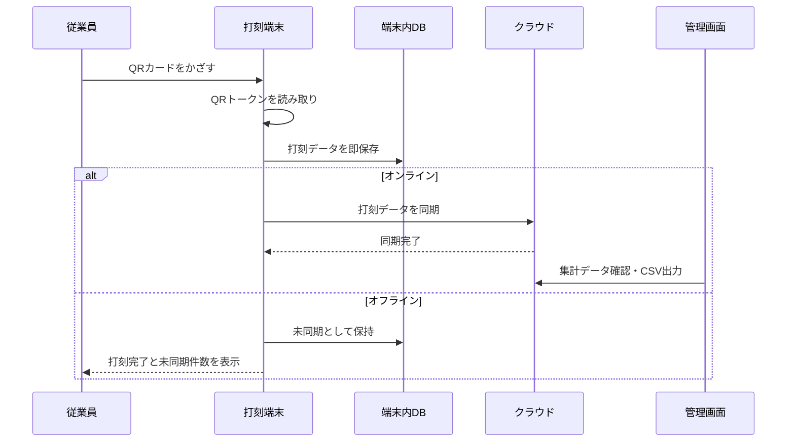

# TQR Screen Structure

## Punch Terminal Layout

TQRの打刻端末は、スマホ・タブレットどちらでも横向き固定を基本にする。

目的:

- QR読み取りエリアを大きく確保する
- 現在の打刻モードを遠目でも分かるようにする
- 6種類の打刻ボタンを常時表示する
- 同期状態と未同期件数を現場で確認できるようにする



## Mode Behavior

通常モードは時刻で自動判定する。



一時モードは「元のモード」へ戻さず、復帰時点の時刻で通常モードを再判定する。

## Punch Flow



## Terminal Wireframe

```text
┌─────────────────────────────────────────────────────────────────────┐
│ TQR トータル勤怠       出勤モード              09:18    同期済み  │
├─────────────────────────────────────────────────────────────────────┤
│ ┌──────────────┐ ┌──────────────────────┐ ┌──────────────────┐ │
│ │              │ │                      │ │                  │ │
│ │   出勤       │ │  QRコードを          │ │  読み取り待機    │ │
│ │   緑背景     │ │  かざしてください    │ │                  │ │
│ │              │ │                      │ │  未同期 0件      │ │
│ │ 自動判定中   │ │     [カメラ枠]       │ │  端末登録済み    │ │
│ │              │ │                      │ │                  │ │
│ └──────────────┘ └──────────────────────┘ └──────────────────┘ │
├─────────────────────────────────────────────────────────────────────┤
│ [出勤] [退勤] [休憩入り] [休憩戻り] [中抜け] [中戻り] [管理]       │
└─────────────────────────────────────────────────────────────────────┘
```

## Design Notes

- 出勤は緑、退勤は赤を使う
- 色だけに依存せず、大きな文字と固定位置で区別する
- 各ボタンは44px以上のタッチ領域を確保する
- 現場端末なので装飾より視認性を優先する
- 管理操作はPIN入力後の裏メニューにまとめる
- 通信状態、未同期件数、端末登録状態は常時表示する

## Theme And Asset Customization

アイコン、ロゴ、背景、色は後から変更できる前提にする。

変更してよいもの:

- アプリロゴ
- アプリアイコン
- 背景色または背景画像
- 端末フレーム色
- 出勤・退勤・休憩などのモード色
- QR読み取り枠の色
- 成功音・エラー音
- ボタン内のアイコン

変更してはいけない基本構造:

- 横向き打刻画面を基本にする
- 現在モードを大きく表示する
- QR読み取りエリアを中央に置く
- 6種類の打刻ボタンを常時表示する
- 同期状態と未同期件数を表示する
- 管理機能はPIN付きの裏メニューに分ける

プロトタイプでは `prototype/index.html` の `:root` にテーマ用CSS変数を集約する。

```css
:root {
  --app-background: ...;
  --logo-image: none;
  --device-frame: #202827;
  --active: #11834f;
  --clock-out: #c92d2d;
  --break-in: #2563eb;
  --break-out: #0f766e;
  --leave: #c45f10;
  --return: #6d3bbd;
}
```

ロゴ画像に差し替える場合は、将来的に以下のような指定にする。

```css
:root {
  --logo-image: url("../assets/logo/tqr-logo.svg");
}
```

背景画像に差し替える場合は、画面の読みやすさを優先し、コントラストが落ちる写真や細かい模様は避ける。

推奨ルール:

- 背景は淡色または低コントラストにする
- 打刻モード色は視認性を優先する
- 出勤と退勤は必ず明確に違う色にする
- 色だけでなく文字と位置でも判別できるようにする
- 現場端末では装飾より操作ミス防止を優先する

## Suggested Asset Structure

```text
assets/
  logo/
    tqr-logo.svg
    tqr-logo-dark.svg
  icons/
    clock-in.svg
    clock-out.svg
    break-in.svg
    break-out.svg
    leave.svg
    return.svg
  backgrounds/
    terminal-bg-light.webp
```

初期開発では画像ファイルが未確定でもよい。レイアウト側はテキストロゴとCSS背景で成立させ、正式ロゴや背景が決まった段階で差し替える。
